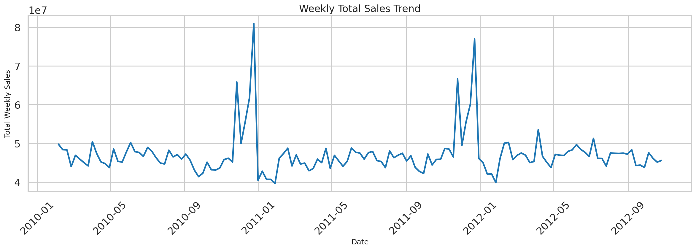

# Integrated Retail Analytics for Store Optimization

**From weekly retail data to clearer store planning decisions**

📊 **EDA** &nbsp; 🚨 **Anomaly Detection** &nbsp; 🧩 **Store Segmentation** &nbsp; 🧺 **Proxy Basket Rules** &nbsp; 🔮 **Demand Forecasting**

This project analyses weekly retail sales to support better store planning, promotion review, anomaly monitoring, segmentation, and demand forecasting.

## Business problem

Retail stores do not all behave in the same way. Sales can change because of seasonality, holidays, promotions, store size, weather, and wider economic conditions. The project combines these views so that unusual demand and different store patterns are easier to identify before planning decisions are made.

## Data

The project uses the Walmart-style weekly retail dataset:

- `dateset/sales data-set.csv`: weekly sales by store and department
- `dateset/Features data set.csv`: weather, fuel price, markdown, CPI, unemployment, and holiday information
- `dateset/stores data-set.csv`: store type and store size

The data covers 45 stores, 81 departments, and weekly records from February 2010 to October 2012.

## Analysis included

- Data quality checks, merging, missing-value treatment, outlier capping, scaling, PCA, and feature selection
- EDA across stores, departments, time, holidays, markdowns, and external factors
- Anomaly detection with IQR logic, Isolation Forest, LOF, and One-Class SVM
- Store segmentation with KMeans, Agglomerative Clustering, DBSCAN, and MeanShift comparison
- Proxy market basket analysis using store-week department activity
- Association rules with support, confidence, lift, and leverage
- Forecast comparison using moving average, exponential smoothing, and SARIMAX
- Store-department forecast benchmarking for the final test period

## Main results

Tuned seasonal exponential smoothing was the best overall model, with test WAPE of approximately 1.27%. The detailed store-department benchmark covered 45 stores and 80 departments in the final test window and achieved WAPE of approximately 11.05%. Department 43 had no observations in that final window because its available records ended earlier in the dataset.

## Run the notebook

Open `Integrated Retail Analytics for Store Optimization.ipynb` in Google Colab. Mount Google Drive and keep the `dateset/` folder at the project location expected by the notebook. The notebook saves tables, model files, and figures under `colab_outputs/`.

The notebook installs missing packages when required, so no separate local environment is needed for the Colab workflow.

## Outputs

`colab_outputs/` contains the final model metrics, anomaly and segmentation summaries, association rules, store-department forecast results, saved model bundle, and figures used for interpretation.
